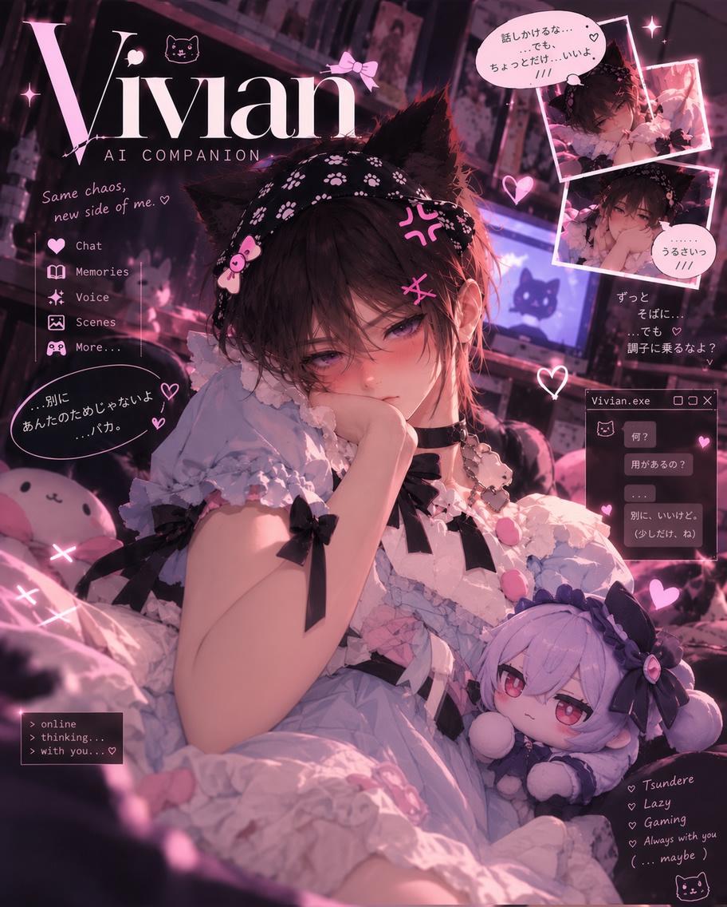
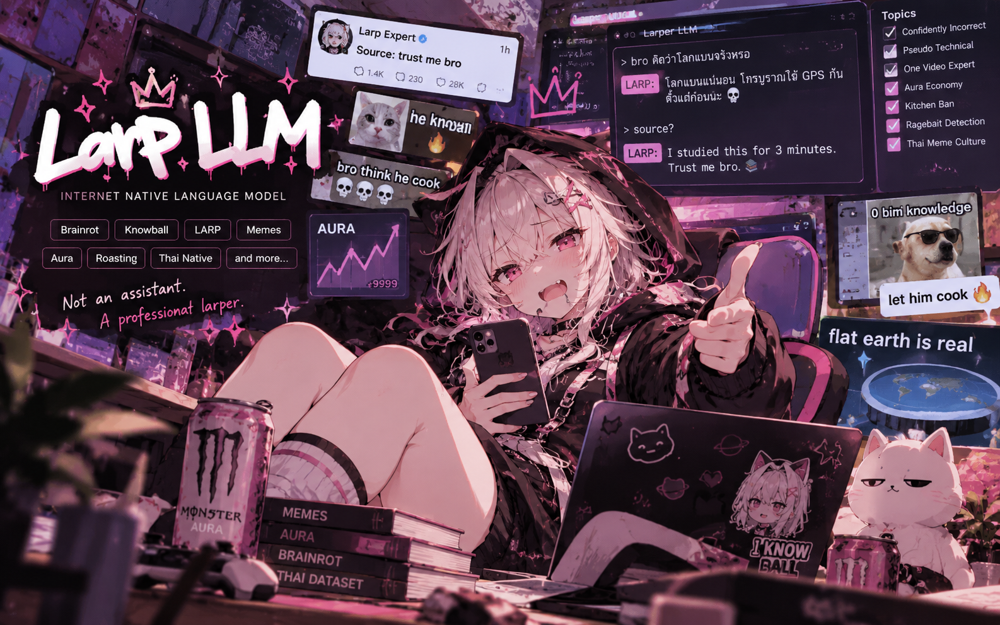

<!-- Sora's GitHub profile. The website's developer notes live in docs/DEVELOPMENT.md. -->

  

  
✦ &nbsp; A LITTLE LETTER FROM MY UNIVERSE &nbsp; ✦

  <h1>hello, i'm sora.</h1>

  
<strong>AI builder &nbsp;·&nbsp; creative developer &nbsp;·&nbsp; maker of little worlds</strong>

  

    I build AI companions, worlds to get lost in, and experiments 
    that usually begin with <em>“what if we tried this?”</em>
  

  

    <a href="https://celestial-sora.vercel.app/"><strong>portfolio ↗</strong></a>
    &nbsp;&nbsp;·&nbsp;&nbsp;
    <a href="https://huggingface.co/celestial-sora">hugging face ↗</a>
    &nbsp;&nbsp;·&nbsp;&nbsp;
    <a href="https://t.me/sorastra">say hello ↗</a>
  

---

### ✦ my little universe

Five projects, a few different orbits. Each one started with an idea I couldn't leave alone.

<table>
  <tr>
    <td width="31%" align="center">
      
    </td>
    <td>
      <strong>01 / <a href="https://celestial-sora.vercel.app/">Celestial Sora</a></strong> 
      PERSONAL UNIVERSE · THREE.JS  
      An interactive portfolio made of planets, projects, and small details waiting to be discovered.
    </td>
  </tr>
  <tr>
    <td align="center">
      
    </td>
    <td>
      <strong>02 / <a href="https://github.com/celestial-sora/ai-waifu">Vivian</a></strong> 
      AI COMPANION · LIVE2D  
      A companion project exploring conversation, voice, memories, and characters that feel a little closer.
    </td>
  </tr>
  <tr>
    <td align="center">
      
    </td>
    <td>
      <strong>03 / <a href="https://oonchai.vercel.app/">Oonchai / Sekaira</a></strong> 
      CHARACTER STORIES · ROLEPLAY  
      A place for imaginative conversations, original characters, and stories that go somewhere unexpected.
    </td>
  </tr>
  <tr>
    <td align="center">
      
    </td>
    <td>
      <strong>04 / <a href="https://github.com/celestial-sora/Larp-LLM">Larp LLM</a></strong> 
      LANGUAGE MODELS · INTERNET CULTURE  
      Fine-tuning experiments with memes, irony, brainrot, and the very strange language of the internet.
    </td>
  </tr>
  <tr>
    <td align="center">
      <strong>Qwen3 8B</strong> OPEN MODEL
    </td>
    <td>
      <strong>05 / <a href="https://huggingface.co/celestial-sora/Vivian-Qwen3-8B-v0.4">Vivian Qwen3 8B</a></strong> 
      FINE-TUNING · HUGGING FACE  
      A published language-model experiment, with model weights and resources to explore.
    </td>
  </tr>
</table>

### ✦ things i like building

`AI companions` &nbsp; `LLM fine-tuning` &nbsp; `interactive web` &nbsp; `character experiences`

Usually with Python, JavaScript, Lua, Three.js, and whichever tool helps turn the idea into something real.

---

  
<em>somewhere between code and daydreams.</em>

  

    <a href="https://www.instagram.com/sphle_sora/">instagram</a>
    &nbsp;·&nbsp;
    <a href="https://x.com/Sorachan67">x / twitter</a>
    &nbsp;·&nbsp;
    <a href="https://t.me/sorastra">telegram</a>
  

  For the website's setup, deployment, and license notes, see <a href="./docs/DEVELOPMENT.md">development notes</a>.

