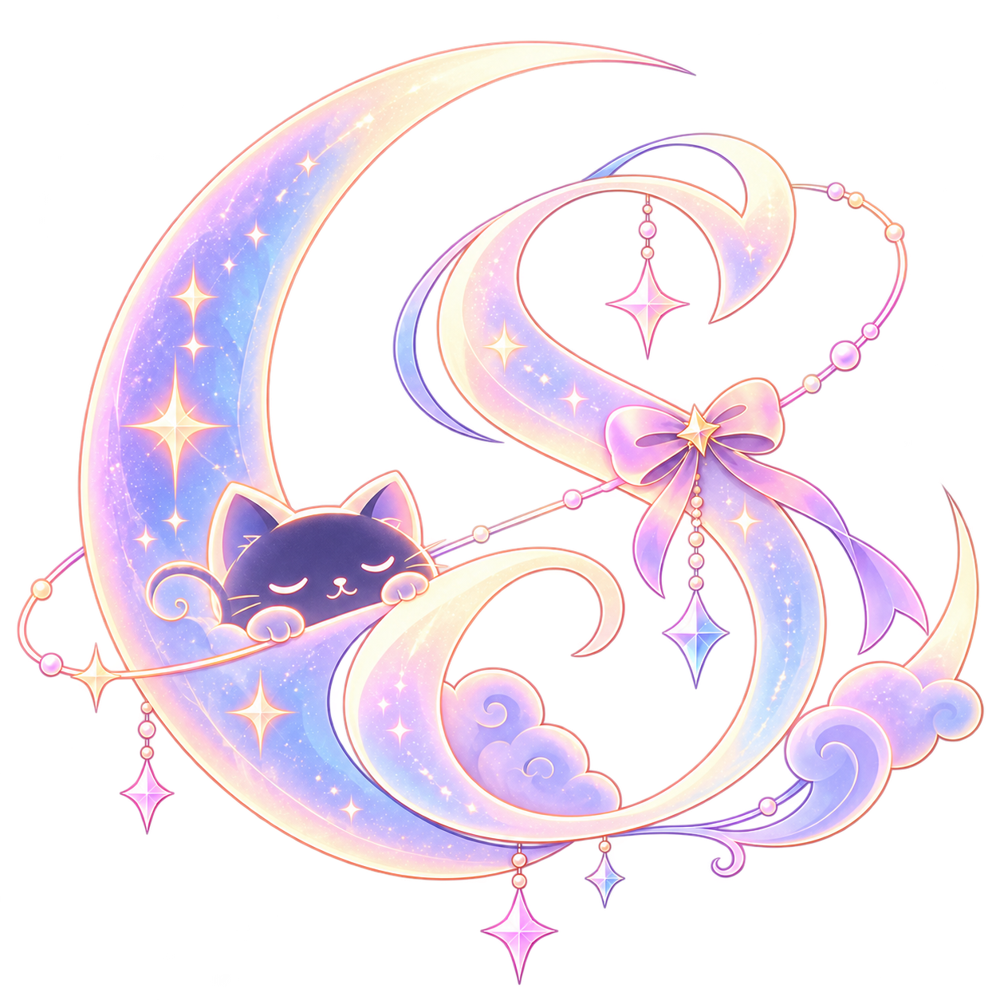

<!-- Sora's GitHub profile. The website's developer notes live in docs/DEVELOPMENT.md. -->

  

  
✦ &nbsp; A LITTLE LETTER FROM MY UNIVERSE &nbsp; ✦

  <h1>hello, i'm sora.</h1>

  
<strong>AI builder &nbsp;·&nbsp; creative developer &nbsp;·&nbsp; maker of little worlds</strong>

  

    I build AI companions, worlds to get lost in, and experiments 
    that usually begin with <em>“what if we tried this?”</em>
  

  

    <a href="https://celestial-sora.vercel.app/"><strong>portfolio ↗</strong></a>
    &nbsp;&nbsp;·&nbsp;&nbsp;
    <a href="https://huggingface.co/celestial-sora">hugging face ↗</a>
    &nbsp;&nbsp;·&nbsp;&nbsp;
    <a href="https://t.me/sorastra">say hello ↗</a>
  

---

### ✦ things i like building

`AI companions` &nbsp; `LLM fine-tuning` &nbsp; `interactive web` &nbsp; `character experiences`

Usually with Python, JavaScript, Lua, Three.js, and whichever tool helps turn the idea into something real.

---

  
<em>somewhere between code and daydreams.</em>

  

    <a href="https://www.instagram.com/sphle_sora/">instagram</a>
    &nbsp;·&nbsp;
    <a href="https://x.com/Sorachan67">x / twitter</a>
    &nbsp;·&nbsp;
    <a href="https://t.me/sorastra">telegram</a>
  

  For the website's setup, deployment, and license notes, see <a href="./docs/DEVELOPMENT.md">development notes</a>.

